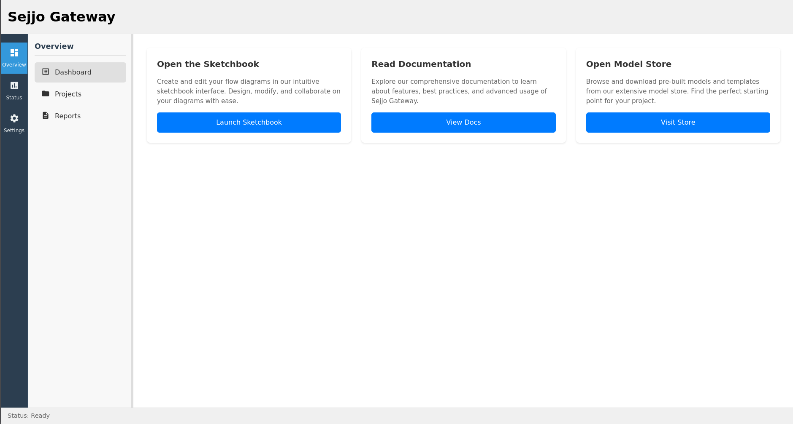

# Sejjo Gateway

A modern React web application serving as a base platform for developing webapps on top of it. It features workflow automation, project management, and an intuitive interface for creating and managing flow diagrams.

## Screenshot



## Project Overview

Sejjo Gateway is a responsive web application built with React 19, TypeScript, and Material UI. It provides a comprehensive interface for creating, managing, and organizing workflow automation projects with an intuitive flow diagram editor.

## Technology Stack

- **Frontend Framework**: React 19 with TypeScript
- **Build Tool**: Vite
- **UI Components**: Material UI v7
- **Development Environment**: Fedora Toolbox (js-projects container)

## Project Structure

```
src/
├── components/
│   └── navigation/
│       ├── PrimaryNav.tsx
│       └── SecondaryNav.tsx
├── layouts/
│   └── MainLayout.tsx
├── pages/
│   ├── overview/
│   │   ├── Dashboard.tsx
│   │   ├── Projects.tsx
│   │   └── Reports.tsx
│   └── status/
│       ├── Alarms.tsx
│       ├── AuditTrail.tsx
│       ├── Services.tsx
│       └── SystemStatus.tsx
├── types/
│   └── navigation.ts
├── config/
│   └── navigation.tsx
├── hooks/
│   └── useResizable.ts
├── App.tsx
└── index.css
```

## Features

### 1. Project Management
- **Hierarchical Project Organization**
  - Folder-based project structure
  - Nested folders support
  - Intuitive tree view navigation
  - Project search functionality

- **Project Details Panel**
  - Full-height vertical panel
  - Smooth slide-in/out animations
  - Quick access to project actions
  - Real-time project information

### 2. Navigation System
- **Primary Navigation**: Fixed-width (64px) sidebar with main section navigation
  - Overview
  - Status
  - Settings

- **Secondary Navigation**: Resizable panel (200-300px) with context-specific navigation
  - Dynamic content based on primary navigation selection
  - Smooth resize functionality

### 3. Flow Editor
- **Sketchbook Interface**
  - Intuitive diagram creation
  - Real-time collaboration support
  - Custom node types
  - Connection management

### 4. UI/UX Features
- **Modern Interface**
  - Material Design components
  - Responsive layout
  - Smooth transitions and animations
  - Consistent styling

- **Project Tree View**
  - Expandable/collapsible folders
  - Visual folder hierarchy
  - Quick project access
  - Intuitive navigation

## Layout Components

### MainLayout
- Grid-based structure
- Header, footer, and main content areas
- Flexible content rendering

### Project Components
- **TreeView**: Hierarchical project navigation
- **DetailsPanel**: Full-height project information
- **SearchBar**: Project filtering and search
- **ActionButtons**: Quick access to common actions

## Styling

The application uses Material UI v7 with custom styling:

- Consistent color palette
- Responsive layouts
- Interactive components
- Smooth animations
- Custom transitions
- Modern typography

## Current Status

### Implemented Features
- ✅ Project tree view navigation
- ✅ Full-height details panel
- ✅ Project search functionality
- ✅ Folder organization
- ✅ Basic application structure
- ✅ Material UI integration
- ✅ Responsive layout

### Pending Features
- 🔄 Flow diagram editor
- 🔄 User authentication
- 🔄 Project collaboration
- 🔄 Data persistence
- 🔄 API integration
- 🔄 Real-time updates

## Development Setup

1. Ensure you have Node.js installed
2. Clone the repository
3. Install dependencies:
   ```bash
   npm install
   ```
4. Start the development server:
   ```bash
   npm run dev
   ```

## Best Practices

1. **Component Architecture**
   - Modular component design
   - Clear separation of concerns
   - Reusable components
   - Type-safe interfaces

2. **State Management**
   - Local component state
   - Prop drilling minimization
   - Clear data flow
   - Type-safe state

3. **Code Organization**
   - Feature-based structure
   - Clear file naming
   - Consistent patterns
   - TypeScript implementation

4. **Styling**
   - Material UI theming
   - Consistent spacing
   - Responsive design
   - Animation standards

## Next Steps

1. Implement flow diagram editor
2. Add user authentication
3. Enable project collaboration
4. Implement data persistence
5. Add real-time updates
6. Enable project sharing
7. Add version control
8. Implement export/import

## Contributing

Please read [CONTRIBUTING.md](CONTRIBUTING.md) for details on our code of conduct and the process for submitting pull requests.

## License

This project is licensed under the MIT License - see the [LICENSE](LICENSE) file for details.

## Disclaimer

This project was developed with the assistance of Cursor AI.
